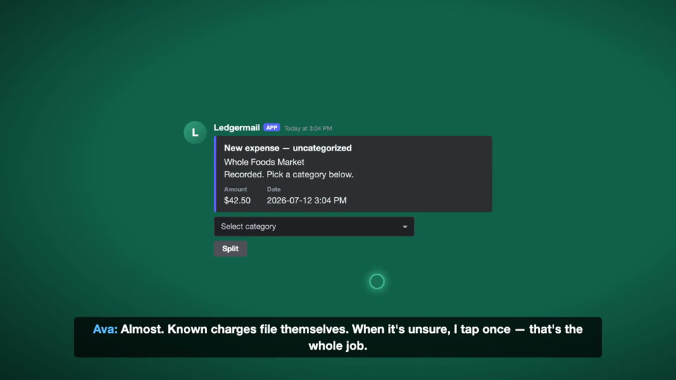
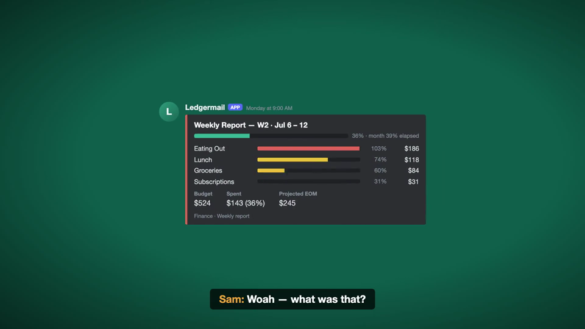

# Ledger Starter

カードの利用通知メールを読んで、Notion の家計簿に1行足す。銀行にもカード会社にもパスワードを渡さない。

*Reads the charge notification emails your card already sends, and files them into your own Notion database. No bank connection, no aggregation service.*

対応は三井住友・楽天カード・ビューカードの3社。Google Apps Script と Notion だけで動き、月額の費用はかからない。

---

## 何が起きるか

コンビニでカードを切る。数分後、家計簿に行が増えている。

| 日付 | 名前 | 金額 | カード | 分類 |
|---|---|---|---|---|
| 2026-09-21 | セブン-イレブン | ¥398 | 三井住友 | 食費 |

記帳のたびに Discord へ通知できる。Webhook URL を `Config.gs` に貼るだけ。設定しなければ通知せずに動く。

さらに、**通知に付いたメニューから分類をその場で直せる**。押すと Notion の行が書き換わり、Discord のメッセージも更新される。

通知を出すだけの仕組みは、間違いを見つけても直す場所が別にあるので、結局使われなくなる。**押した場所でそのまま直せること**を設計の起点にした。

## 難しいのは「読むこと」ではなく「重ねないこと」

カード会社ごとに、通知の届き方が違う。

- **三井住友** — 利用の数分後に速報。iD払いなど速報が来ない利用は、数日後の明細で届く。明細には速報と同じ利用も混ざる。
- **楽天カード** — 速報には店名が入らない。数日後の確定版を待って記帳する。
- **ビューカード** — 速報は店名が「国内加盟店」。約1週間後の確報で本当の店名に書き換える。行は増やさない。

同じ買い物が2行になる経路が、カード会社ごとに違う形で存在する。`Code.gs` の大半はここに使っている。

- 処理済みのメールIDを保存し、同じメールを二度読まない
- 三井住友の明細とビューカードの確報は、Notion の既存行を日付と金額で照合してから書く
- 書き込みが1件でも失敗したら、その回はそこで止める。速報より先に確報を入れないため

## 中身

| ファイル | 中身 |
|---|---|
| [`Code.gs`](Code.gs) | Gmail を読んで Notion へ書く本体（283行） |
| [`Config.gs`](Config.gs) | 書き換えるのは2か所だけ |
| [`notion-template.md`](notion-template.md) | Notion 側に作る表の定義 |
| [`worker.js`](worker.js) | Discord の署名を検証して GAS へ中継する（75行・任意） |
| [`SETUP.md`](SETUP.md) | 設定手順と、動かないときの見分け方 |

## 使うには

`SETUP.md` の通りに進めれば、記帳だけなら目安30分で動く。Discord のボタンまで入れると45〜50分。
どちらもプログラミングの経験は要らず、コピーと貼り付けだけで進む。
用意するものは Gmail と Notion のアカウントだけ。Google Apps Script は無料で、月額のサービスは使わない。

`SETUP.md` の最後に「できないこと」を全部書いてある。**買う前ではなく、動かす前に読んでほしい。**
外貨、取消と返品、同日同額の2回目など、取りこぼす条件が実際にある。

## これは何の一部か

自分の家計と生活を自動化した仕組みから、**記帳の部分だけ**を切り出して、他の人が動かせる形にしたもの。

本体の方は、これに加えて次を動かしている。**この配布物には入っていない。**

- 明細CSVと台帳の突合、月次レポートの自動生成
- 各社サイトへログインしての明細・領収書の無人取得
- Cloudflare Workers + D1 による予算アプリ

## ライセンス

MIT

## なぜ Worker が要るのか

Discord から「ボタンが押された」という通知は、**署名つきで HTTP ヘッダーに載って**飛んでくる。Discord は受け取る側がその署名を検証できることを要求する。

ところが **Google Apps Script の `doPost` は HTTP ヘッダーを一切受け取れない**（Google が意図した仕様）。だから GAS を直接 Discord に繋ぐことはできない。

そこで Cloudflare Worker を1枚挟む。Worker が署名を検証し、通った中身だけを GAS へ渡す。Worker のコードは75行で、やっているのは検証と中継だけ。

## 確かめたこと・確かめていないこと

確かめた: 署名の検証（正しい署名は通り、改ざんと無署名は弾く）、3秒以内の応答（実測0.32秒）、GAS から Notion への更新要求。

**確かめていない: 実際に Discord の画面でボタンを押すところ。** 開発者ポータルへのログインを伴うため、手元で通しの確認ができていない。動かないところがあれば issue で教えてほしい。
