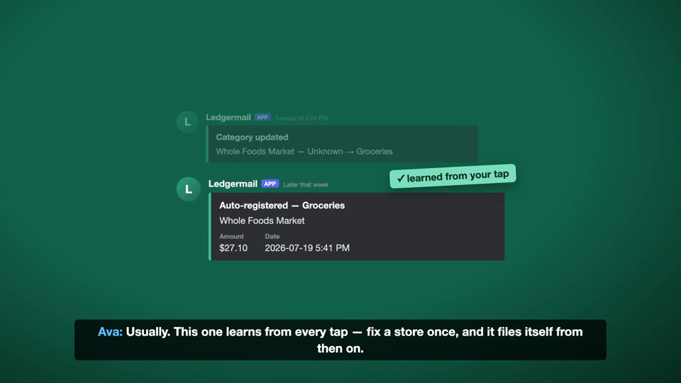

# Ledger Starter

カードの利用通知メールを読んで、Notion の家計簿に1行足す。銀行にもカード会社にもパスワードを渡さない。

*Reads the charge notification emails your card already sends, and files them into your own Notion database. No bank connection, no aggregation service.*

対応は三井住友・楽天カード・ビューカードの3社。Google Apps Script と Notion だけで動き、月額の費用はかからない。

---

## 何が起きるか

コンビニでカードを切る。数分後、家計簿に行が増えている。

| 日付 | 名前 | 金額 | カード | 分類 |
|---|---|---|---|---|
| 2026-09-21 | セブン-イレブン | ¥398 | 三井住友 | 食費 |

分類が外れていたら、通知のボタンを押して直す。スマホから数秒。家計簿を開き直す必要はない。

一度直した店は、次から自分で正しい分類に入る。

## 難しいのは「読むこと」ではなく「重ねないこと」

カード会社ごとに、通知の届き方が違う。

- **三井住友** — 利用の数分後に速報。iD払いなど速報が来ない利用は、数日後の明細で届く。明細には速報と同じ利用も混ざる。
- **楽天カード** — 速報には店名が入らない。数日後の確定版を待って記帳する。
- **ビューカード** — 速報は店名が「国内加盟店」。約1週間後の確報で本当の店名に書き換える。行は増やさない。

同じ買い物が2行になる経路が、カード会社ごとに違う形で存在する。`Code.gs` の大半はここに使っている。

- 処理済みのメールIDを保存し、同じメールを二度読まない
- 三井住友の明細とビューカードの確報は、Notion の既存行を日付と金額で照合してから書く
- 書き込みが1件でも失敗したら、その回はそこで止める。速報より先に確報を入れないため

## 中身

| ファイル | 中身 |
|---|---|
| [`Code.gs`](Code.gs) | Gmail を読んで Notion へ書く本体（283行） |
| [`Config.gs`](Config.gs) | 書き換えるのは2か所だけ |
| [`notion-template.md`](notion-template.md) | Notion 側に作る表の定義 |
| [`SETUP.md`](SETUP.md) | 設定手順と、動かないときの見分け方 |

## 使うには

`SETUP.md` の通りに進めれば、目安30分で動く。プログラミングの経験は要らない。
用意するものは Gmail と Notion のアカウントだけ。Google Apps Script は無料で、月額のサービスは使わない。

`SETUP.md` の最後に「できないこと」を全部書いてある。**買う前ではなく、動かす前に読んでほしい。**
外貨、取消と返品、同日同額の2回目など、取りこぼす条件が実際にある。

## これは何の一部か

自分の家計と生活を自動化した仕組みの一部を、他の人が動かせる形に切り出したもの。
本体では、これに加えて明細CSVとの突合、月次レポート、ポイント残高の巡回などを動かしている。

## ライセンス

MIT
